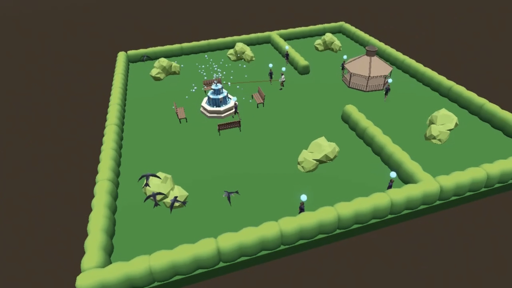
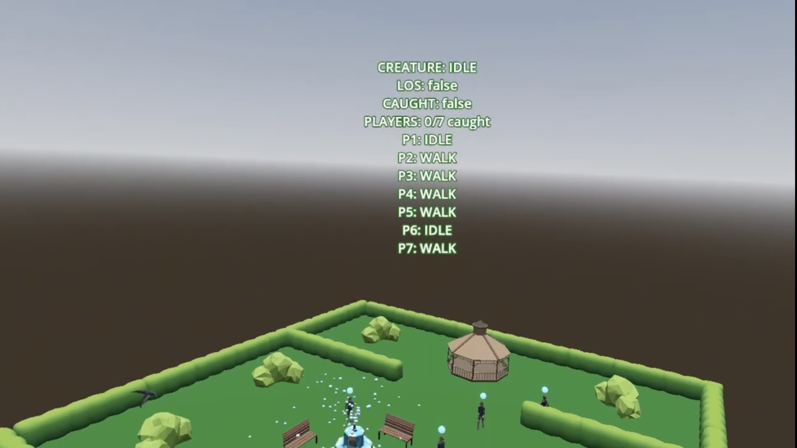
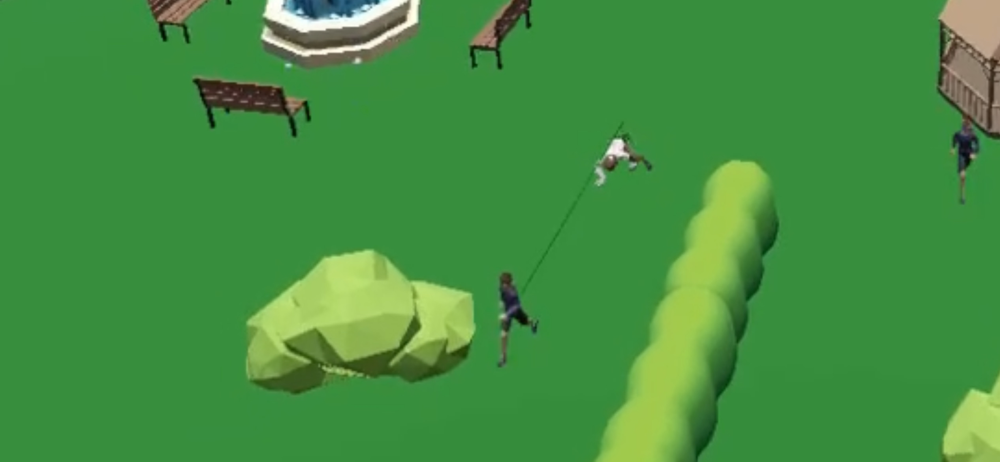
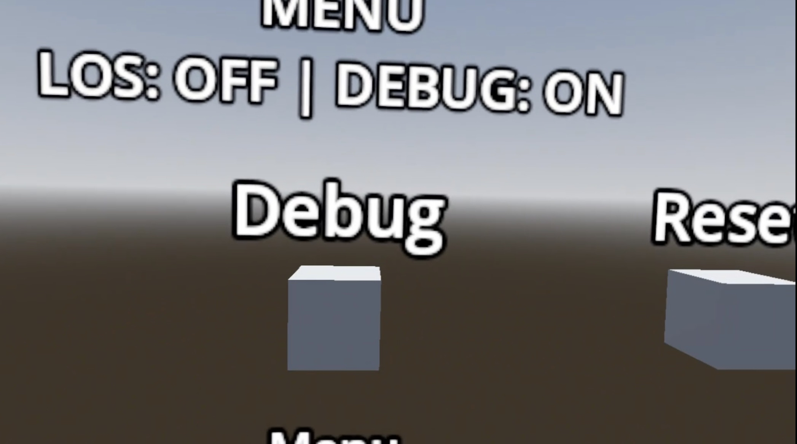

# Autonomous-Agents-Assignment
| **Name**     | **Student Number** |
| ----------- | ----------- |
| Karl Negrillo      | C22386123       |

# XR Autonomous Creature Chasing
Name: Karl Negrillo  
Student Number: C22386123  
Github: Kubzz00  
Assisgnment Repo: [AutonomousChasingCreature](https://github.com/Kubzz00/AutonomousChasingCreature)

# Video

The video shows an XR/MR autonomous simulation running as a floating park diorama. The user observes the simulation in VR/MR while a creature autonomously wanders, detects player agents using line-of-sight, chases them, and catches them. Multiple player agents move around the park, flee when detected, and the simulation resets once all players are caught. The video also shows hand-collision menu buttons, debug toggles, animated agents, particle effects, audio, and Boids-style flocking birds.

# Screenshots

# Description of Project

This project is an XR autonomous simulation built in Godot 4.6. The scene is designed as a floating low-poly park diorama viewed in VR/MR. Instead of controlling a normal player character, the user acts as an observer watching autonomous agents interact inside the environment.

The main simulation is a predator-prey system. A creature moves around the park using a finite-state machine and detects player agents using line-of-sight raycasting. When the creature sees a player, it enters a chase state. Player agents respond by fleeing. When a player is caught, they enter a caught state. Once all player agents are caught, the simulation resets automatically.

The project also includes hand-tracking presence, floating hand-collision menu buttons, animated models, particle effects, spatial audio, debug visualisation, and a Boids-inspired flocking system using animated birds to make the park feel more alive.

# Instruction of Use
1. Open the Godot project inside the `autonomous-chasing-creature` folder
2. Export or run the project using the Quest 3 Android export preset.
3. Launch the application on headset.
4. The floating park diorama should appear in front of the user.
5. Watch the creature wander around the park.
6. When the creature’s line-of-sight detects a player agent, it will chase them.
7. Player agents will flee when detected.
8. When a player is caught, they stop and play the caught/death state.
9. Once all players are caught, the simulation resets after a short delay.
10. Use the floating menu buttons with your hand collision pointer:
   - **Toggle LOS**: shows/hides line-of-sight debug lines.
   - **Toggle Debug**: shows/hides debug overlay and state markers.
   - **Reset**: resets the simulation manually.
   - **Hide/Show Menu**: hides or brings back the floating menu.

# How it Works

The project is built around autonomous agent behaviour. The creature and player agents are controlled using finite-state machines. The creature has `IDLE`, `WANDER`, `CHASE`, and `CATCH` states. The player agents have `IDLE`, `WALK`, `FLEE`, and `CAUGHT` states.

The creature uses raycasting as a line-of-sight perception system. While wandering, it casts a ray forward to check if a player is visible. If the ray hits a player, the creature changes to the chase state. During chase, it follows the current target until it catches them or loses sight.

The spawn manager handles multiple player agents. It spawns the creature and several players at marker points in the park. When a player is caught, the creature selects another uncaught player. When all players are caught, the spawn manager waits briefly and resets the full simulation.

The floating menu uses `Area3D` collision shapes. The user’s hand pointer enters a button’s collision area, and that button emits a signal to the menu controller. The menu can toggle LOS lines, debug visuals, reset the simulation, and hide/show itself.

The Boids system adds animated birds to the environment. Each bird uses separation, alignment, and cohesion forces to move as a small flock while staying inside the park bounds. This is separate from the main creature/player AI and is used to make the scene feel more alive.

# List of Classes/Assets in the Project

| Class/asset | Source |
|---|---|
| `CreatureBrain.gd` | Self-written with AI guidance. Controls creature FSM, LOS detection, chase, catch, audio, animation, and reset logic. |
| `PlayerBrain.gd` | Self-written with AI guidance. Controls player FSM, walking, fleeing, caught state, audio, animation, and death particles. |
| `SpawnManager.gd` | Self-written with AI guidance. Spawns creature and multiple player agents, tracks caught players, and resets the simulation. |
| `DebugOverlay.gd` | Self-written. Displays creature state, player states, LOS status, and caught player count. |
| `StateVisualController.gd` | Self-written. Changes agent state markers based on FSM state. |
| `FloatingMenuController.gd` | Self-written Controls floating XR buttons for LOS, debug, reset, and hide/show menu. |
| `FloatingMenuButton.gd` | Self-written. Detects hand collision with floating menu buttons and emits button actions. |
| `BoidManager.gd` | Self-written with AI guidance. Spawns and manages flocking bird agents. |
| `BoidAgent.gd` | Self-written with AI guidance. Implements Boids-style separation, alignment, cohesion, and bounds steering. |
| `ArenaRotator.gd` | Self-written. Slowly rotates the park diorama for better XR viewing. |
| Player model and animations | Resources came with [poly.pizza](https://poly.pizza/m/gKLBoRsyKe) |
| Creature model and animations | Resources came with [poly.pizza](https://poly.pizza/m/xqEzosAVYX) |
| Bird model and flying animation | External low-poly bird asset on [SketchFab](https://sketchfab.com/3d-models/simple-bird-0257796e6a114739ab20339beb8ce537). Used as the visual layer for Boids. |
| Park/environment assets | Resources came from [poyl.pizza](https://poly.pizza/) |
| Fountain particles | Self-made `GPUParticles3D` effect. |
| Death particles | Self-made `GPUParticles3D` effect triggered when a player is caught. |
| Audio files | Downloaded in [Pixabay](https://pixabay.com/music/) |
| XR setup | Godot OpenXR / XR Tools / OpenXR Vendors plugin. |
| Hand tracking setup | Hand pose detector / XR hand tracking setup. |

# References

# References

[Godot Engine Documentation](https://docs.godotengine.org/)  
Used as the main reference for Godot features such as `Node3D`, `CharacterBody3D`, `Area3D`, `GPUParticles3D`, `AnimationPlayer`, audio nodes, signals, exported variables, and scene organisation.

[Godot XR Tools](https://docs.godotengine.org/en/latest/tutorials/xr/introducing_xr_tools.html)  
Used as a reference for setting up XR interaction concepts in Godot, including VR scene structure, hand/controller interaction, and XR-ready scene design.

[Godot OpenXR Vendors Plugin](https://github.com/GodotVR/godot_openxr_vendors)  
Used for OpenXR headset support and MR functionality, allowing the park simulation to be viewed as a floating mixed-reality diorama.

[Poly.Pizza](https://poly.pizza/)  
Used as a source for low-poly assets and visual style references. The low-poly asset style helped the environment stay lightweight and readable in XR.

[Mixamo](https://www.mixamo.com/)  
Used for character animation references/assets, including simple walking, running, idle, and catch/death-style animations for the autonomous agents.

[Sketchfab](https://sketchfab.com/)  
Used as a source for external 3D models such as animated creature, player, bird, or environment assets where suitable for the project.

[Craig Reynolds - Boids](https://www.red3d.com/cwr/boids/)  
Used as the main conceptual reference for the Boids flocking system. The project applies the key ideas of separation, alignment, and cohesion to create animated bird flock behaviour in the park.

[Steering Behaviour](https://www.red3d.com/cwr/papers/1999/gdc99steer.html)  
Used as a reference for autonomous movement and steering concepts. This influenced the wandering, fleeing, chasing, and boundary steering logic used by the agents and boids.

[Miniature Rotary Phone](https://github.com/skooter500/miniature-rotary-phone)  
Used as a reference from previous XR project work to understand project structure, interaction style, and how XR assignments can be organised and documented.

# What I am Most Proud Of
I am most proud of getting the autonomous behaviour working. The creature uses a finite-state machine (FSM) with idle, wander, chase, and catch states, instead of just moving directly toward the player all the time. It only starts chasing when its line-of-sight raycast detects a player, which makes the behaviour feel more believable.

I am also proud of turning it into a multi-agent system. Several player agents can spawn, get caught individually, and stay caught while the creature continues searching for the remaining players. Once all players are caught, the simulation resets automatically.

The Boids system is another part I am happy with. I understand Boids as a flocking algorithm using separation, alignment, and cohesion. In my project, the birds avoid crowding, move in similar directions, and stay together as a small flock, adding life to the park.

I am also proud of the XR features, including floating hand-collision buttons, debug toggles, animations, audio, state markers, and particle effects.

# Problems of Assignment
One main problem was making movement feel natural. At first, agents moved too quickly, got stuck near edges, or looked robotic. I had to adjust speeds, smooth direction changes, and tune the wandering behaviour.

Line-of-sight also took testing. Early versions made the creature chase too directly, so I changed it to use forward raycasting. Getting the debug LOS line to match the actual detection ray also required fixes.

Managing many systems together was challenging. FSMs, raycasting, animations, audio, particles, Boids, hand buttons, and multiple players all had to work together without breaking the simulation.

Asset integration was also difficult because some imported models had hidden nodes, empty animation players, or needed scaling and rotation fixes.

# What I learned
I learned how FSMs can structure autonomous behaviour clearly. The creature and players each have separate states, making the logic easier to manage and debug.

I learned how raycasts can be used for perception, especially for line-of-sight detection.

I learned how Boids create flocking using separation, alignment, and cohesion, and how this can add environmental life without affecting the main AI system.

# Proposal
## Project Idea
This project involves creating a 3D environment where a **creature autonomously chases** an AI player in an environment. The AI player will try to avoid capture, while the creature follows using basic AI behaviors. The goal is to create a dynamic system where both entities act autonomously, with animated movements and sound effects to enhance the chase.

## Project Goals
Create a 3D environment where the AI player is autonomously chased by a creature. The AI will avoid the creature while the creature will pursue it. The project will focus on creating an engaging chase with basic AI behaviors and immersive sound and animations. The player’s role is to observe the chase without direct interaction.

## Key Features

- **Autonomy & Personality**: Both the creature and AI player act based on proximity and environmental factors, with the creature showing persistent chasing behavior and the AI reacting (running, hiding, etc.).

- **Steering Behaviors**: The creature uses **Seek** to autonomously chase the AI player, while the AI uses **Avoidance** to escape or hide when it gets too close.

- **Finite State Machine (FSM)**: Manages the creature’s and AI player’s states, such as idle, chasing, hiding, and running. 

- **Behavior Trees**: Define the creature’s decision-making process, such as when to start chasing, how to react when it loses sight of the player, and how it behaves when it catches the AI.

- **Procedural Animations**: Smooth animations for natural movements like running, hiding, and chasing, making both the creature and AI player feel alive.

- **Sound Design**: Spatialized audio enhances immersion, with growls, footsteps, and breath sounds dynamically changing as the creature gets closer.

- **AI Interactions**: The AI player reacts to the creature’s presence by running or hiding, while the creature adapts its behavior based on the AI player’s movements.

## Gameplay

- **Autonomous Creature**: The creature autonomously chases the AI player based on proximity, navigating obstacles and responding to lost sight of the AI.
  
- **Autonomous AI Player**: The AI player tries to evade capture, using obstacles and the environment to hide or run.
  
- **Chase Dynamics**: The creature pursues the AI continuously, reacting to its movements. The AI hides or runs when needed.

- **Hiding & Evasion**: The AI can hide behind obstacles or escape, forcing the creature to search for it.
  
- **Catching the AI**: The chase ends when the creature catches the AI, triggering a **catching animation**.

## XR Technologies Used
  
- **Spatial Audio**: Dynamic sound effects that increase in volume as the creature gets closer.
  
- **VR Interactions**: The user observes the chase in an immersive VR environment with dynamic sounds and actions.

## Tools and Resources

- **Godot Engine**
  
- **Mixamo**: pre-made 3D models and animations  This saves time on animation work and provides a wide variety of natural, realistic animations.
  
- **Blender**
  
- will link more later on the project.